# Airbnb NYC / Análise Exploratória e Clusterização

Análise exploratória de dados (EDA) e clusterização de anúncios do Airbnb em Nova York, com foco em identificar perfis de imóveis e padrões de comportamento dos hosts.

## Objetivo do projeto

Investigar o mercado de Airbnb em Nova York a partir dos dados de 2019, buscando responder:

- Como os preços se distribuem pela cidade?
- Quais bairros e distritos concentram os imóveis mais caros?
- Existe relação entre número de reviews e preço?
- É possível segmentar os anúncios em perfis distintos?
- Quais características definem cada perfil de imóvel?

## Dataset

| Campo | Detalhe |
|---|---|
| Fonte | Kaggle |
| Arquivo | AB_NYC_2019.csv |
| Tema | Airbnb Open Data — Nova York, 2019 |

Os dados incluem localização geográfica, preço, tipo de quarto, número de reviews, disponibilidade anual, mínimo de noites e informações sobre os hosts.

## Tecnologias Utilizadas

- Python
- Pandas
- NumPy
- Matplotlib
- Seaborn
- Scikit-Learn 

## Tratamento de Dados

- Remoção das colunas `id`, `host_name` e `last_review`
- Preenchimento de valores nulos:
  - `reviews_per_month` == 0
  - `name` == 'unknown'
- Remoção de outliers de preço com o método IQR (~6% dos registros)

## Análises realizadas 

### 1. Distribuição de Preços

**Distribuição com outliers**

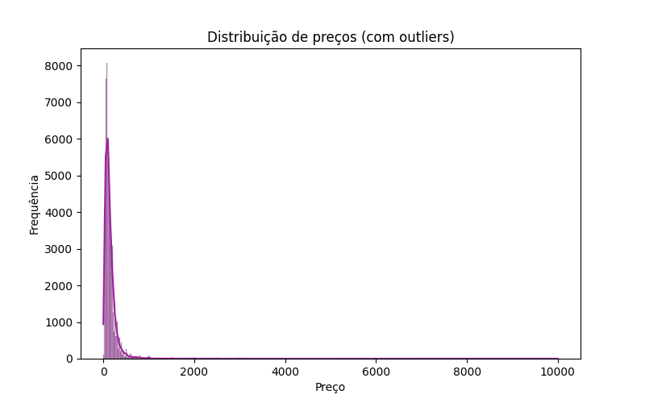

> A distribuição de preços é fortemente assimétrica à direita, com poucos imóveis de preço muito elevado distorcendo a visualização.
> Cerca de 6% dos registros foram identificados como outliers com base no método IQR

---

**Distribuição sem outliers**

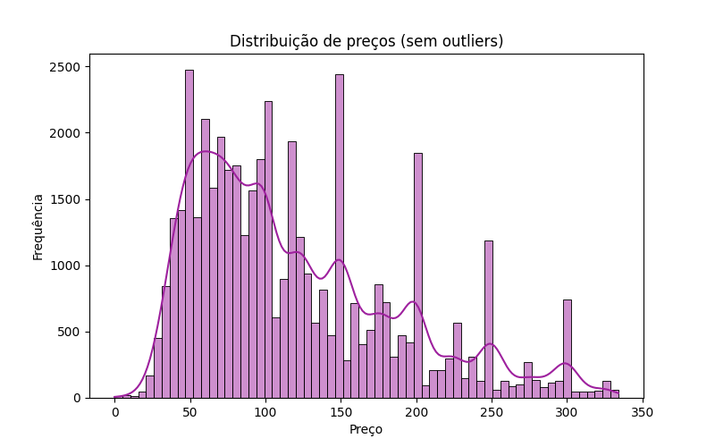

> Após a remoção de outliers pelo método IQR, a distribuição revela que a maioria dos imóveis se concentra na faixa de $50 a $150 por noite.

---

### 2. Preços por Distrito e Bairro

**Média de preços por distrito**

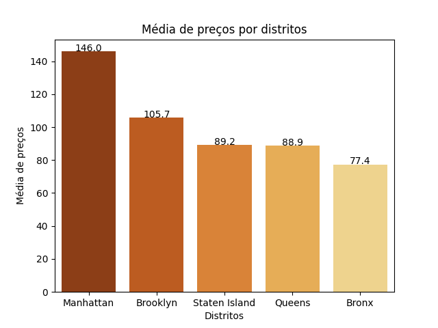

> Manhattan lidera com a maior média de preços ($146), seguida por Brooklyn ($105.7). O Bronx apresenta os valores mais acessíveis ($77.4).

**Top 10 bairros mais caros**

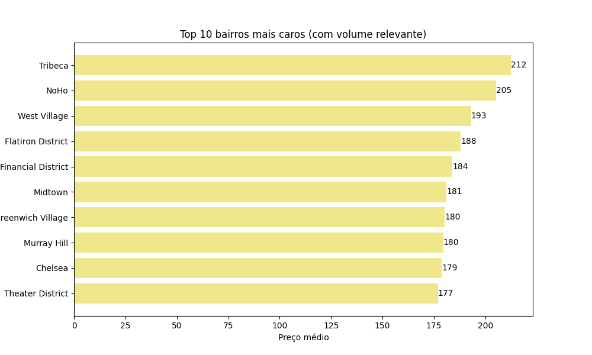

> Alguns dos bairros mais caros com volume relevante de imóveis (mais de 50 anúncios) são Tribeca, NoHo e West Village, a maior parte concentra-se em Manhattan.

---

### 3. Distribuição Geográfica dos Preços

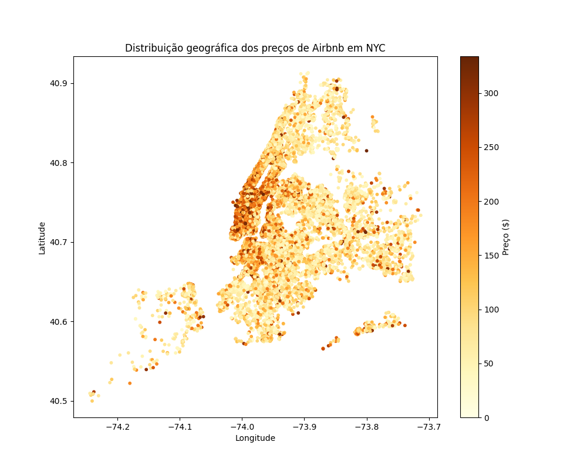

> A distribuição geográfica evidencia a concentração de imóveis mais caros (mais alaranjados) na região central de Manhattan, com queda gradual de preços em direção às periferias.

---

### 4. Relação entre Reviews e Preço

> A correlação entre número de reviews e preço é praticamente nula (-0.0277), indicando que não há relação linear significativa entre essas variáveis.

---

### 5. Correlação entre Variáveis

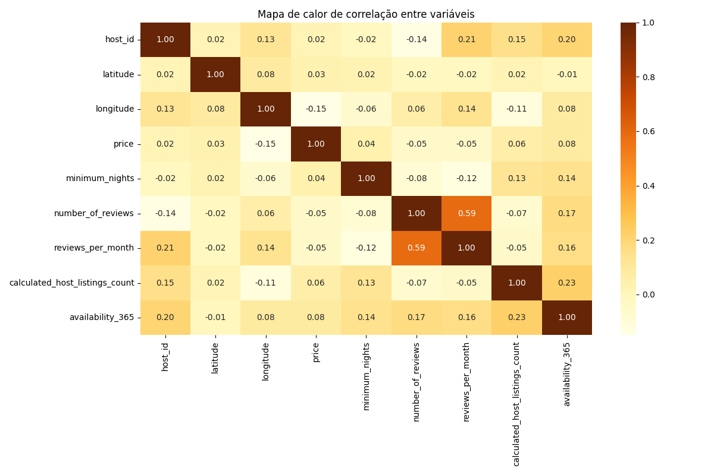

> O mapa de correlação indica que a maioria das variáveis possui baixa relação linear entre si. Em especial, o preço apresenta correlação muito fraca com as demais variáveis, incluindo número de reviews e reviews por mês. A única relação moderada observada foi entre número de reviews e reviews por mês (0.59), o que é esperado. Esses resultados sugerem que o preço é influenciado por outros fatores, possivelmente categóricos ou não lineares.

---

## Clusterização

### Metodologia

A clusterização foi realizada com o algoritmo **K-Means**, utilizando as seguintes features:

| Feature | Descrição |
|---|---|
| `price` | Preço por noite |
| `minimum_nights` | Mínimo de noites exigido |
| `number_of_reviews` | Total de reviews |
| `reviews_per_month` | Frequência de reviews |
| `calculated_host_listings_count` | Quantidade de imóveis do host |
| `availability_365` | Dias disponíveis no ano |
| `latitude` | Latitude do imóvel |
| `longitude` | Longitude do imóvel |

Os dados foram normalizados com `StandardScaler` antes da clusterização.

---

**Tentativa com DBSCAN**

Antes de optar pelo K-Means, foi testado o algoritmo DBSCAN para identificar agrupamentos por densidade.

- **Metodologia:** Utilizou-se o gráfico de K-Nearest Neighbors (k-NN) com k=9 para determinar o `eps` ideal, analisando o ponto de curvatura (cotovelo) das distâncias.

| Gráfico k-NN Original | Zoom no Cotovelo |
|:---:|:---:|
| 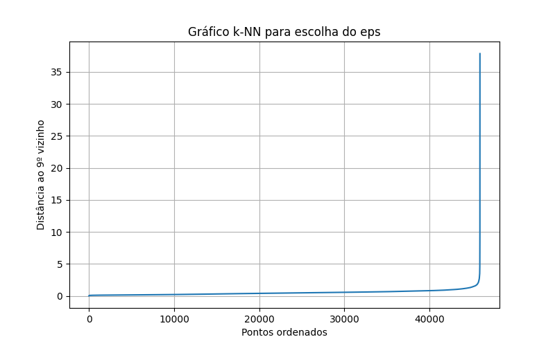 | 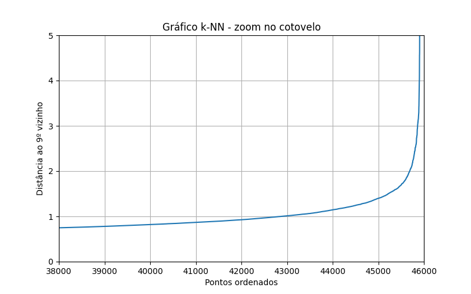 |

- **Testes Realizados:** Foram testados valores de eps entre 1.5 e 3.0

- **Resultado:** O modelo apresentou baixa performance para este dataset, alocando entre 94% e 98% dos dados em um único cluster (Cluster 0), enquanto o restante foi classificado como ruído (outliers).

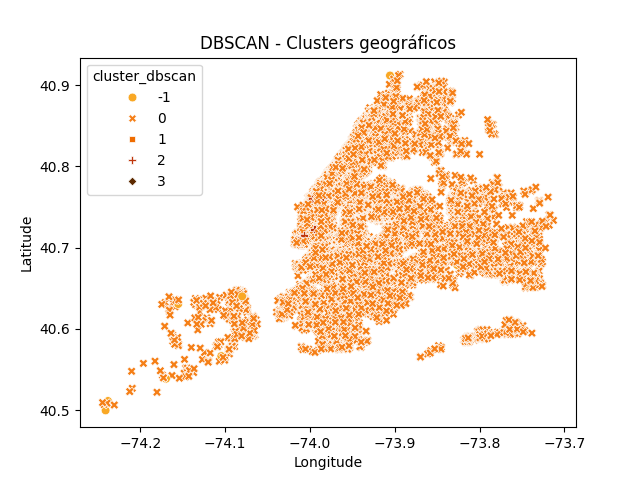

> O DBSCAN falhou em segmentar os dados de forma útil, pois a distribuição dos imóveis em Nova York é muito homogênea em termos de densidade. 98% dos dados foram alocados em um único grupo, impossibilitando a diferenciação de perfis. Por isso, seguimos com o K-Means, que segmentou o mercado de forma equilibrada em 3 perfis distintos.

---

### Escolha do número de clusters

**Método do Cotovelo**

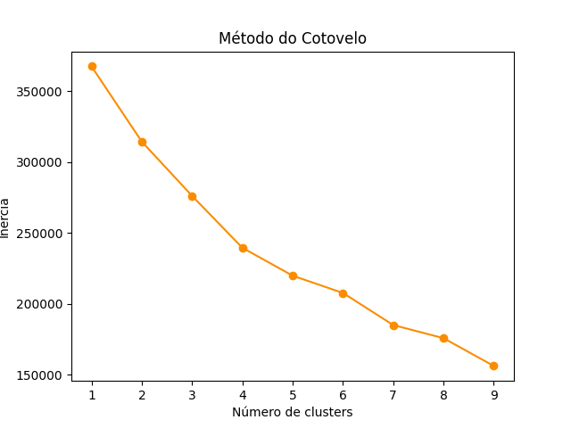

> O gráfico do cotovelo não apresentou um ponto de inflexão claro, indicando que os dados não formam clusters naturalmente bem separados.

**Método da Silhueta**

| k | Silhouette Score |
|---|---|
| 2 | 0.2659 |
| **3** | **0.2662** |
| 4 | 0.2562 |
| 5 | 0.2610 |
| 6 | 0.2518 |

> O valor **k=3** foi escolhido por apresentar o maior silhouette score, sendo validado por ambos os métodos.

**Centróides**

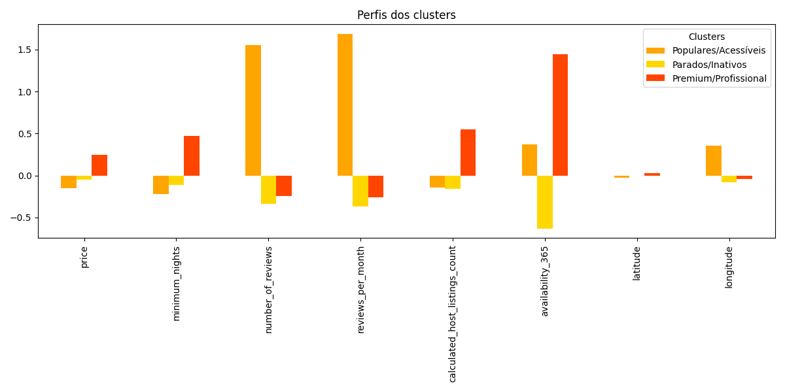

> - Os centróides revelam que o primeiro cluster possuem imóveis com preços mais baixos (-0.15), número de reviews mais altos (1.55) e níveis de disponibilidades ao longo do ano médio (0.37). Por esses motivos, podem ser considerados **Populares/Acessíveis**. 
> - Já os anúncios de imóveis do segundo cluster são considerados **Parados/Inativos** por terem pouca disponibilidade ao longo do ano (-0.63), além dos hosts possuírem menos casas listadas (-0.16).  
> - Os perfis de anúncios do último cluster podem ser apontados como **Premium/Profissional** por terem preços mais elevados (0.24), hosts com mais imóveis listados (0.55) e grande disponibilidade ao longo do ano (1.45)

### Perfis dos Clusters

**Métricas médias por cluster**

| Preço Médio por Cluster | Métricas Médias por Cluster |
|:---:|:---:|
| 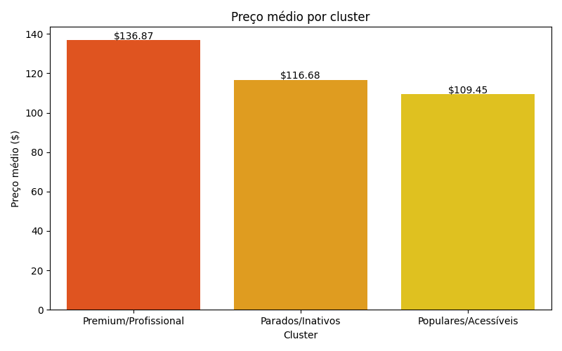 | 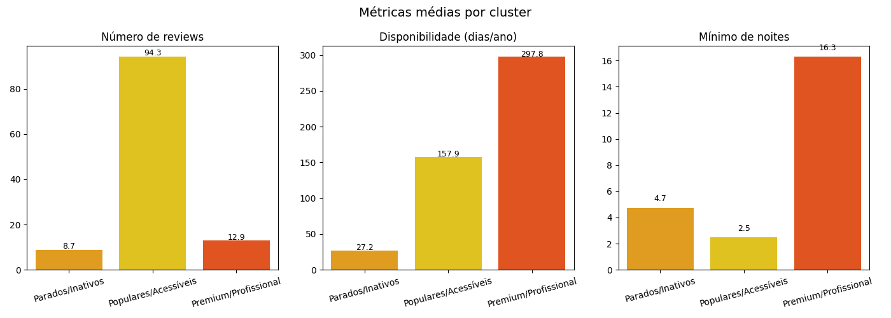 |

| Cluster | Preço médio | Reviews | Disponibilidade | Mínimo de noites |
|---|---|---|---|---|
| Populares/Acessíveis | $109 | 94 | 158 dias | 2.5 noites |
| Parados/Inativos | $117 | 9 | 27 dias | 4.7 noites |
| Premium/Profissional | $137 | 13 | 298 dias | 16.3 noites |

---

### Distribuição Geográfica dos Clusters

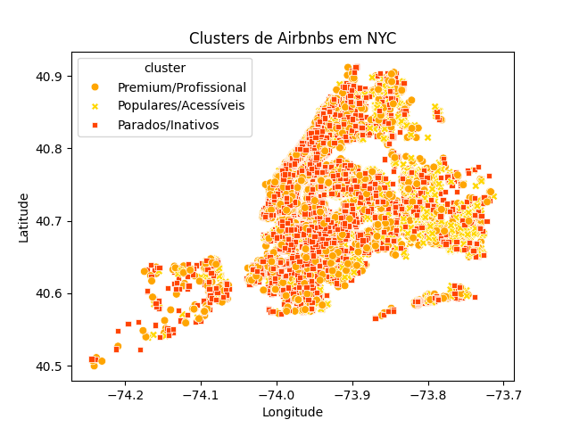

> O mapa de clusters revela uma distribuição espacial com forte sobreposição entre os grupos, indicando que diferentes perfis de imóveis coexistem nas mesmas regiões da cidade.

---

### Distribuição por Distrito

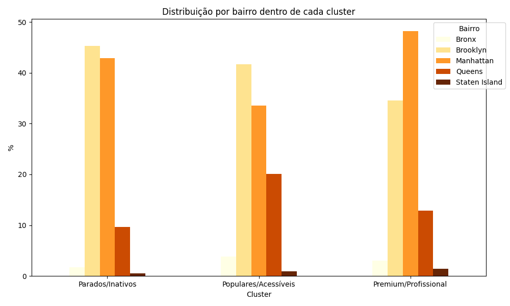

| Cluster | Bairro dominante |
|---|---|
| Parados/Inativos | Brooklyn (45%) e Manhattan (43%) |
| Populares/Acessíveis | Brooklyn (42%), Manhattan (33%) e Queens (20%) |
| Premium/Profissional | Manhattan (48%) |

---

## 🔍 Principais Conclusões

| | Conclusão |
|---|---|
| 🏙️ | Manhattan concentra os imóveis mais caros e os hosts mais profissionais |
| 🌎 | Queens se destaca como o distrito dos imóveis populares e acessíveis |
| 📍 | A localização geográfica não define o perfil do imóvel, o comportamento define |
| ⭐ | Imóveis mais baratos tendem a ter mais reviews, indicando maior volume de reservas |
| 🏠 | 61% dos anúncios são de hosts com baixa movimentação |
| 💼 | Hosts profissionais (cluster Premium) gerenciam em média 23 imóveis cada |
| 📅 | Imóveis Premium ficam disponíveis 298 dias/ano |
| 🚨 | O mínimo de noites é o principal diferencial do cluster Premium (16 noites) |

---

## Oportunidades identificadas

A localização em NYC não define o perfil do imóvel isoladamente, mas sim o **comportamento do host**. Em 2019, o cluster de **imóveis "Inativos"** representava 61% do mercado (disponíveis apenas 27 dias/ano), revelando um enorme potencial para empresas de gestão converterem hosts casuais em operações profissionais. Já o sucesso no cluster Premium é impulsionado pelo **mínimo de noites (16+)** e alta disponibilidade (298 dias/ano), focando no público de médio prazo. Para maximizar o lucro, a estratégia ideal é operar no **Queens para alta rotatividade** ou em **Manhattan para estadias longas (15+ dias)**.

## Autora

Maria Alice Rocha 
Jornalista e pós graduada em Analytics e BI 
Foco em análise de dados, storytelling, ciência de dados e insights acionáveis 